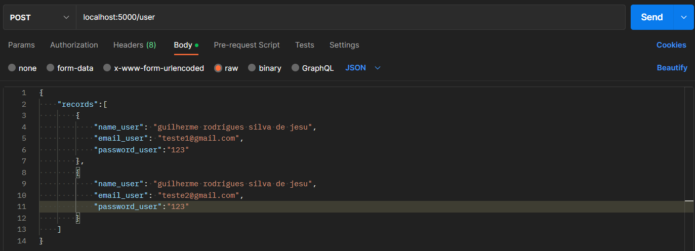
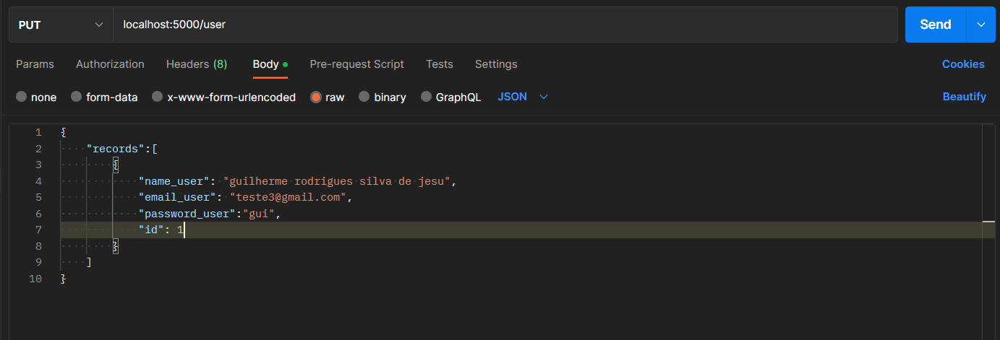
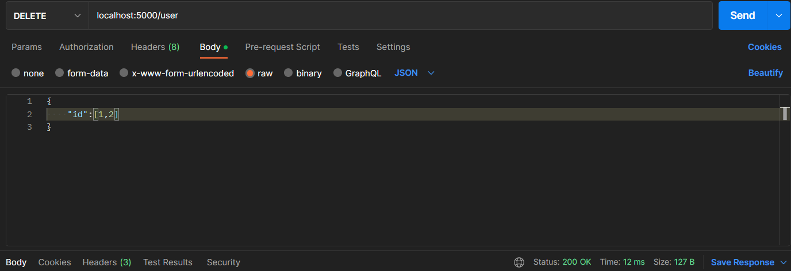
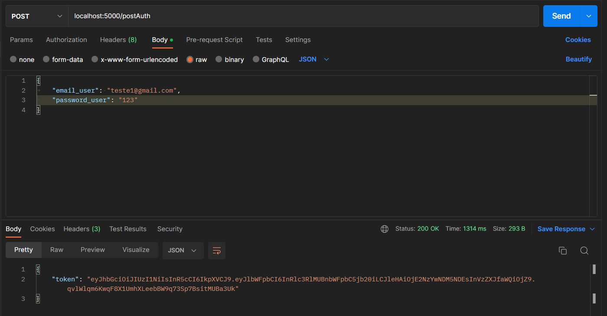
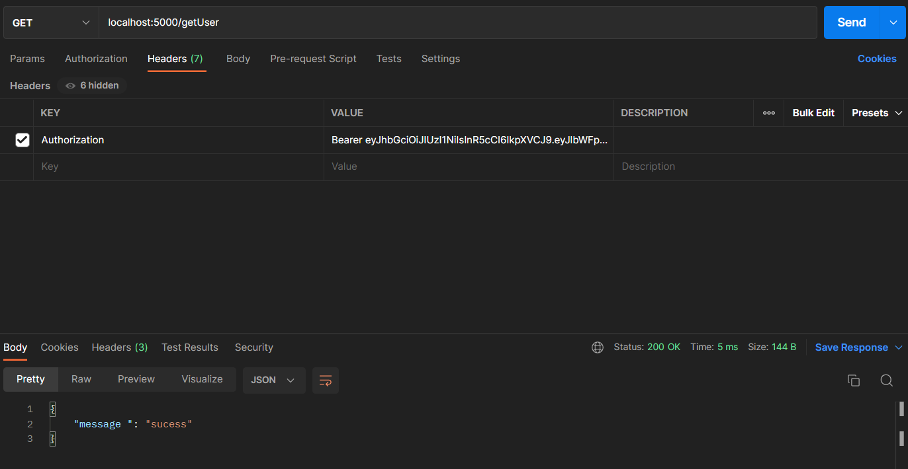

# Autentication Golang + JWT 

<h1> Install and run Project </h1>

git clone https://github.com/guilherm5/jwt-golang.git

go mod tidy

go run main.go

you can test this project by postman or by API Client you want. When running the project with go run main.go, routes will be opened to port 5000

<h2>How to use</h2>

in your preferred Api client, access the routes, using the following paths:
   

method GET: localhost:5000/user - to view users

<h3>Example post</h3>

method POST: localhost:5000/user - to register users

<h3>Example PUT</h3>

method PUT: localhost:5000/user - to update user

<h3>Example DELETE</h3>

method DELETE: localhost:5000/user - to delete users

<h2>Get JWT token</h2>

first you must register a user (and keep your password, because after entering it, your password will be encrypted)

you must provide the registered email and password using the body/json

this will generate you a jwt token

   
<h3>example of how to get token</h3>

method post: localhost:5000/postAuth

   

<h2>how to access route protected by Middleware</h2>

method get: localhost:5000/getUser

<h2> don't forget to update the credentials for your local bank, you can do this by changing the .env file</h2>

<h1>Technologies used:</h2>
<h4>Golang</h4>
<h4>Gin</h4>
<h4>Libpq</h4>
<h4>Postgresql</h4>
<h4>JWT</h4>
